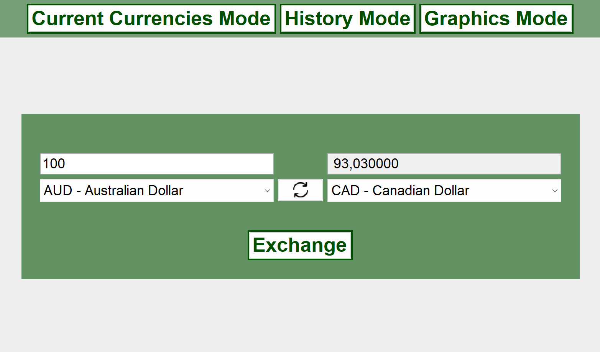
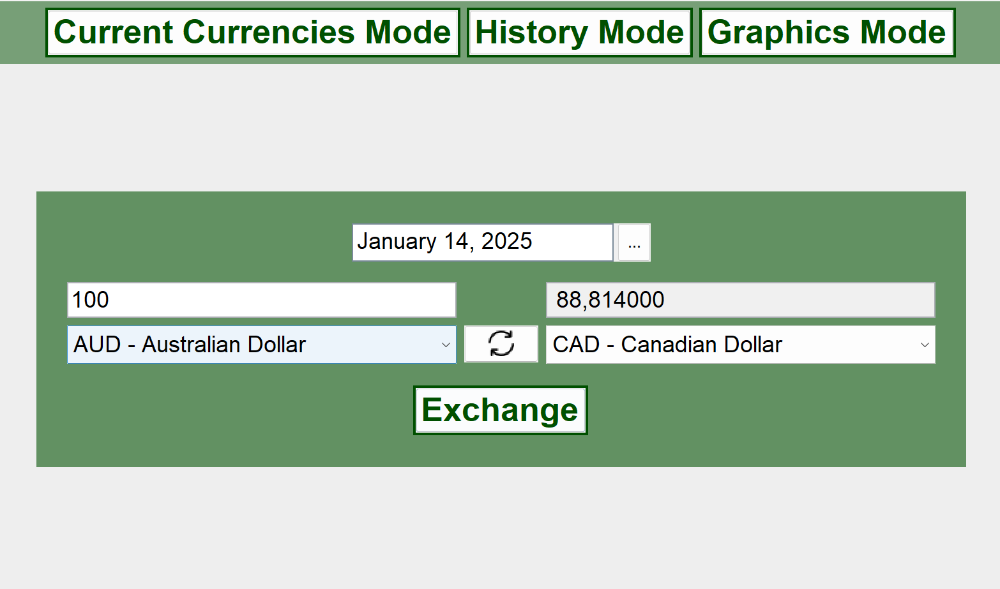
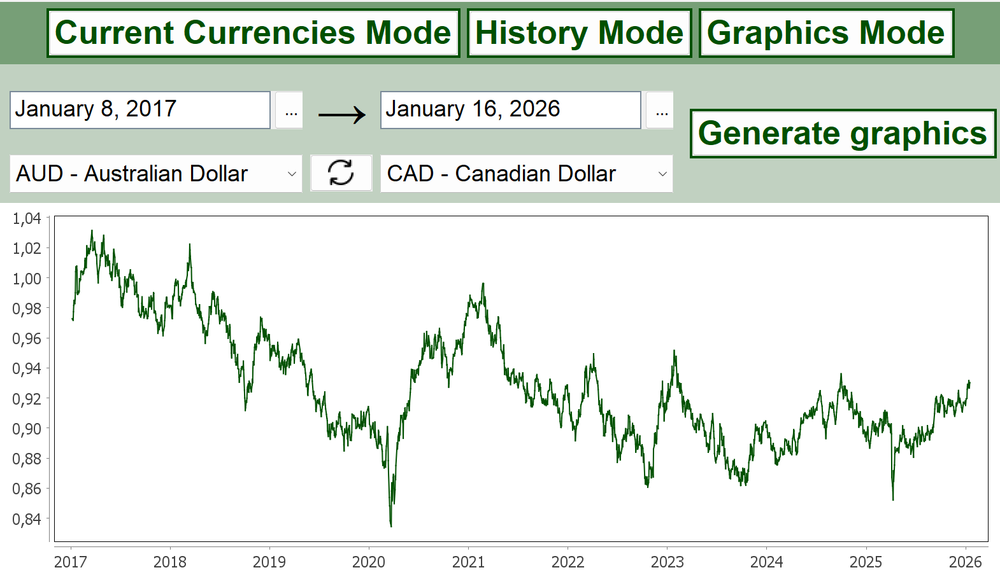

# Money Calculator 2026

Desktop currency converter and rate visualizer built with **Java Swing**.

## Key Features

The application operates in three modes:

1.  **Current Currencies Exchange:** Real-time conversion using the latest market rates provided by [*ExchangeRate-API*](https://www.exchangerate-api.com/).
  

  
2.  **Historical Currencies Exchange:** Historical conversion on a selected date in the past using [*Frankfurter API*](https://www.exchangerate-api.com/).
  

  
3.  **Historical Currencies Series:** Generate a visual line chart showing exchange rate trends between two currencies over a custom date range, using [*Frankfurter API*](https://www.exchangerate-api.com/).
  

  
Each of the modes has been implemented to be able to receive as inputs both the external APIs and an internal *Sqlite* Database. 
This is possible thanks to the **Dependency Injections** in the `Main` class.
---

## Architecture - Model View Controller

The application is strictly structured with the ***Model-View-Controller*** pattern:
* **Model**: Domain representing classes, such as `Currency`, `Money` or `ExchangeRate`. It also contains model-viewing classes such as `LineChart`.
* **View**: Also known as *User Interface*, the view is composed of interfaces that define the graphical implementation's behavior (without actually implementing it, just yet!). One example of a view class could be `ExchangeMoneyDialog`.
* **Controller**: Implemented as a series of commands, that guide the interaction between the architecture's components, like `ExchangeMoneyCommand`.

---
## Other Strategies and Techniques 
The project follows **Clean Code** and **SOLID** principles. Some of the strategies and techniques utilized to comply to these fundaments are:

* **Single Responsibility Principle (SRP)**: Every class has one and only responsibility. This makes a significant impact on abstraction and code legibility.
* **Command Pattern**: Behavioral Design Pattern that decouples the invoking and the actual execution of an action.
* **Dependency Inversion Principle (DIP)**: In order to fully implement the *Command Pattern*, DIP has been applied so that commands are only based on abstractions (and not actual application implementations). The UI and IO elements are injected as dependencies to the commands.
* **Null Object Pattern**: Static constants such as `Currency.Null` are used to manage lack of data and avoid null checking. 
* **Immutability**: All model entities are immutable, making them predictable and easily trackable.

---

## How to Run
1. Place a valid  [*ExchangeRate-API*](https://www.exchangerate-api.com/) Key in `src/main/resources/api-key.txt`.
2. Run the desired `Main`
3. If the database implementation is selected, the application will initialize `currencies.db` and `rates.db` automatically. Otherwise, it will connect to said APIs to fetch the data.

---

## Technical Stack

* **Language:** Java 17+
* **UI Framework:** Swing (Windows Look-and-Feel)
* **JSON Library:** [`Google GSON`](https://mvnrepository.com/artifact/com.google.code.gson/gson)
* **Chart Generator**: [`JFreeChart`](https://mvnrepository.com/artifact/org.jfree/jfreechart)
* **Database:** [`SQLite (JDBC)`](https://mvnrepository.com/artifact/org.xerial/sqlite-jdbc)
* **Date Management:** [`LGoodDatePicker`](https://mvnrepository.com/artifact/com.github.lgooddatepicker/LGoodDatePicker)

---

## Acknowledgements

Uicons by <a href="https://www.flaticon.com/uicons">Flaticon</a>.
